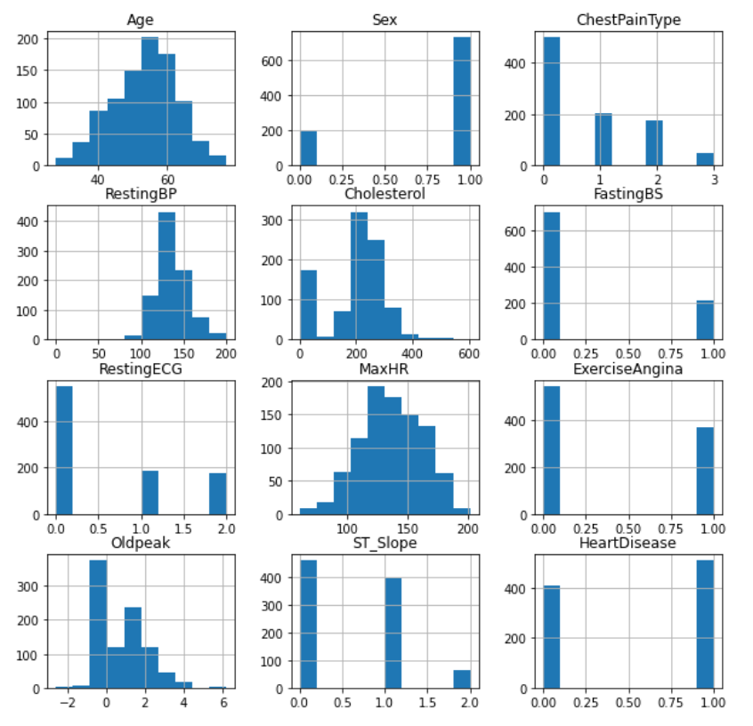

# Heart Failure Predictions
Predicción de casos de ataque cardiaco con modelos de aprendizaje supervisado

Utilizando el dataset público [heart.csv](https://www.kaggle.com/datasets/fedesoriano/heart-failure-prediction) de Kaggle, en el Notebook se llevó a cabo la limpieza de los datos y se aplicaron los modelos de aprendizaje no supervisado *árbol de decisión*, *Máquina de soporte vectorial*, *Redes neuronales*, *Regresión logística*, *Random Forest* y *K-Nearest Neighbors* para predecir la probabilidad de un ataque cardiaco.

En el pdf es posible encontrar el reporte completo con el tratamiento, análisis, implementación de los modelos, resultados y comparativa de los mismos.

